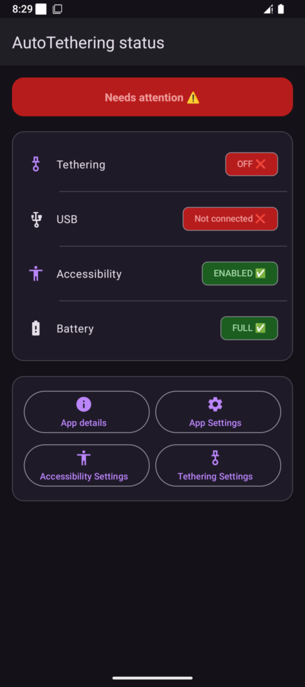
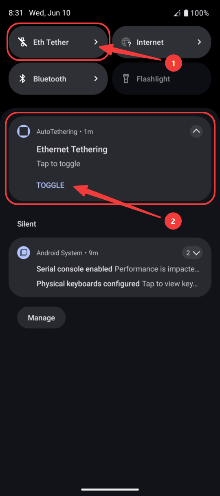
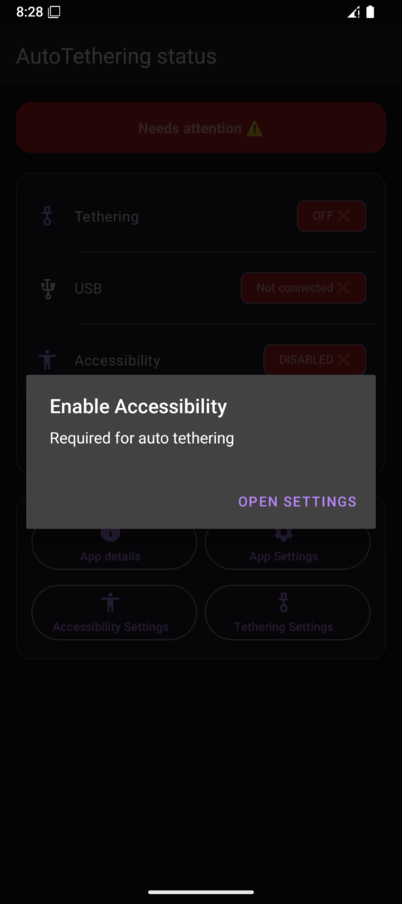
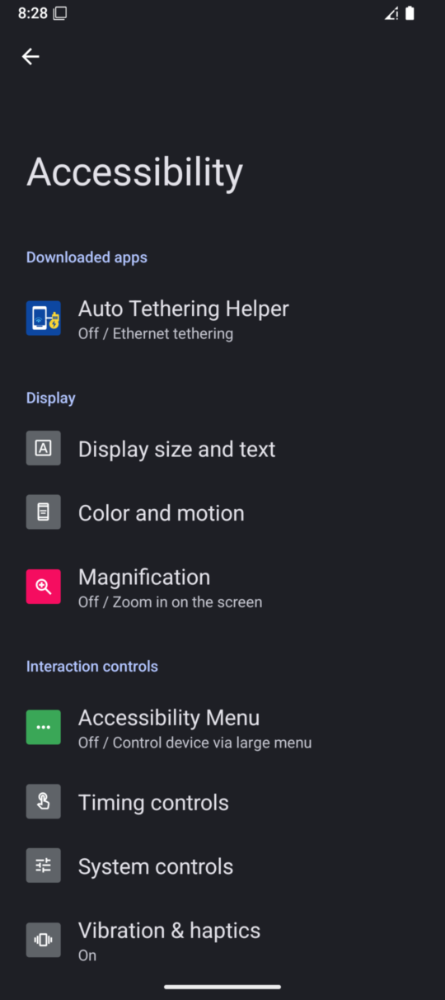
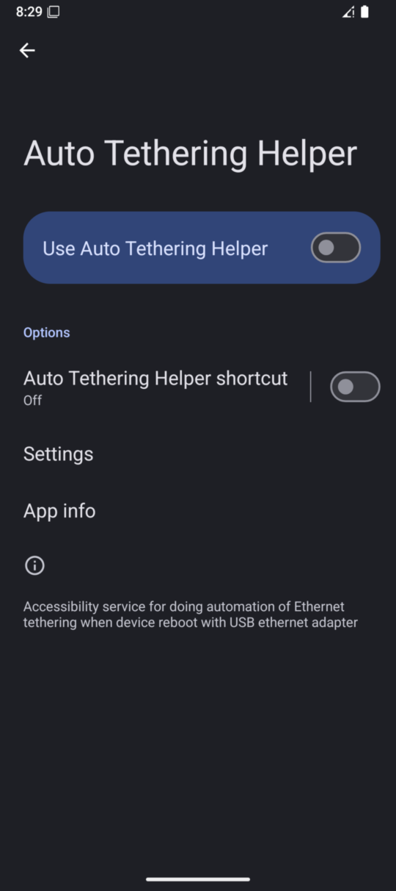
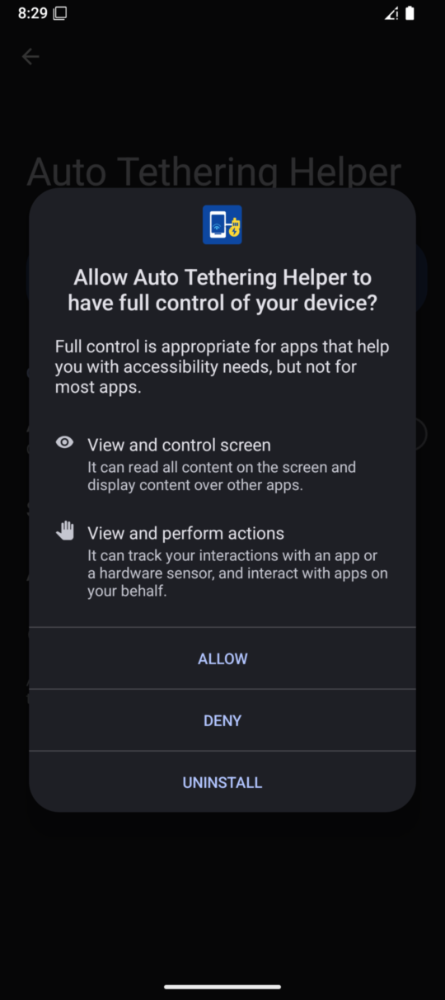
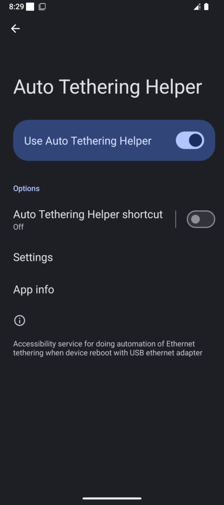
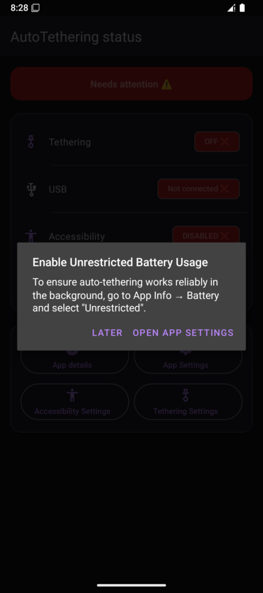
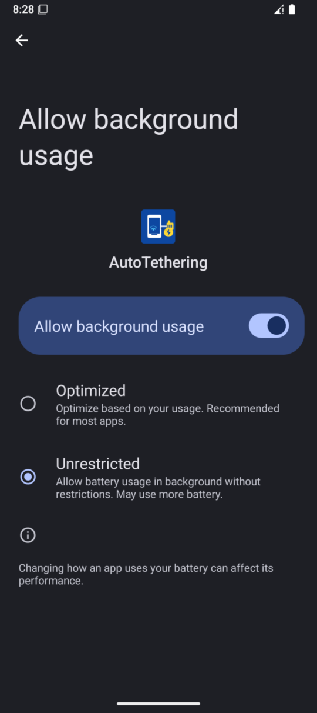

# AutoTethering

Automatically enables Ethernet tethering on Android when a USB Ethernet adapter is plugged in.

No root required. Works entirely through Android's Accessibility API.






---

## The problem it solves

Android does not automatically enable Ethernet tethering when you plug in a USB Ethernet adapter. You have to go to **Settings → Hotspot & tethering → Ethernet tethering** and flip the switch manually every time. This app does that for you.

---

## How it works

```
USB Ethernet adapter plugged in
        ↓
UsbBroadcastReceiver detects attachment event
        ↓
Opens "Hotspot & tethering" settings screen
        ↓
AccessibilityService (TetheringService) scans the UI
        ↓
Finds the "Ethernet tethering" switch
        ↓
Clicks it if it is OFF
        ↓
Confirms toggle by polling switch state
        ↓
Done — Ethernet tethering is active
```

The tethering settings screen opens automatically. The accessibility service finds the "Ethernet tethering" switch and clicks it. The screen remains open afterwards — press Back to return to whatever you were doing. The whole process takes 2–4 seconds after the adapter is physically connected.

---

## Requirements

| Requirement              | Details                                                                 |
|--------------------------|-------------------------------------------------------------------------|
| Android version          | **Android 16 (API 36)** or higher                                       |
| USB Ethernet adapter     | Any USB-A or USB-C adapter recognised by Android as a network interface |
| Accessibility permission | Must be granted manually (app will prompt on first launch)              |
| Battery optimisation     | Must be set to **Unrestricted** (app will prompt on first launch)       |

---

## Setup

### 1. Install the app

Install the APK from the [Releases](../../releases) page. Android will ask you to allow installation from unknown sources if you haven't done so before.

### 2. Enable the Accessibility Service

On first launch the app will open **Accessibility Settings** for you. Find **Auto Tethering Helper** in the list, tap it, and enable it.







> **Why?** The app uses Android's Accessibility API to read the tethering settings screen and click the toggle. This is the only way to do this without root.

### 3. Disable battery optimisation

The app will prompt you to set battery usage to **Unrestricted**. Without this, Android may suspend the app in the background and miss USB attach events.

Go to: **Settings → Apps → AutoTethering → Battery → Unrestricted**





### 4. Plug in your adapter

That's it. Plug in a USB Ethernet adapter — tethering will enable automatically within a few seconds.

---

## Status screen

The main screen shows the current state of all four required conditions:

| Row               | What it checks                                      |
|-------------------|-----------------------------------------------------|
| **Tethering**     | Whether Ethernet tethering is currently active      |
| **USB**           | Whether a USB device is connected                   |
| **Accessibility** | Whether the Accessibility Service is enabled        |
| **Battery**       | Whether battery optimisation is set to Unrestricted |

A banner at the top shows **All systems go ✅** when everything is in order, or **Needs attention ⚠️** if any condition is not met.

---

## Quick Settings tile

The app provides a Quick Settings tile (**Eth Tether**) that you can add to your notification shade:

1. Pull down the notification shade
2. Tap **Edit tiles** (pencil icon)
3. Find **Eth Tether** and drag it into your tile panel

The tile shows the live tethering state (highlighted when ON, grey when OFF). Tapping it opens the tethering settings screen and the accessibility service clicks the toggle automatically.

---

## Persistent notification

A persistent notification labelled **Ethernet Tethering** runs as long as the app is active. It keeps the app process alive in the background and provides a **Toggle** button that opens the tethering settings screen directly from the notification shade.

If the notification disappears, open the app — it will be restarted automatically.

---

## App Settings

If the tethering switch is not being found, your ROM may use different text or a different settings screen. Open **App Settings** from the status screen to customise:

| Setting               | Default                               | When to change                                                                             |
|-----------------------|---------------------------------------|--------------------------------------------------------------------------------------------|
| **Tethering keyword** | `Ethernet tethering`                  | Your ROM uses different wording, or your device language is not English                    |
| **Settings package**  | `com.android.settings`                | Your manufacturer replaced the settings app (e.g. Samsung: `com.samsung.android.settings`) |
| **Settings activity** | `com.android.settings.TetherSettings` | Your ROM uses a different activity class for the tethering screen                          |

Samsung example:
- Package: `com.samsung.android.settings`
- Activity: `com.samsung.android.settings.TetherSettings`

---

## Permissions explained

| Permission                             | Why it is needed                                                       |
|----------------------------------------|------------------------------------------------------------------------|
| `BIND_ACCESSIBILITY_SERVICE`           | Core mechanism — required to read and interact with the Settings UI    |
| `FOREGROUND_SERVICE`                   | Keeps the notification service alive in the background                 |
| `RECEIVE_BOOT_COMPLETED`               | Allows the service to restart after a device reboot                    |
| `ACCESS_NETWORK_STATE`                 | Monitors tethering state for the status screen and Quick Settings tile |
| `POST_NOTIFICATIONS`                   | Shows the persistent tethering-status notification                     |
| `REQUEST_IGNORE_BATTERY_OPTIMIZATIONS` | Requests Unrestricted battery mode so the service is not suspended     |

No internet permission is used. The app does not make any network requests or collect any data.

---

## Architecture

The app consists of four components:

```
TetheringService        AccessibilityService
                        Listens for USB events via BroadcastReceiver.
                        When a USB device is detected, opens the tethering
                        settings screen and clicks the toggle via the
                        Accessibility API.

StatusService           Foreground Service
                        Runs persistently to keep the process alive.
                        Shows the status notification with a Toggle button.

StatusActivity          Main UI
                        Displays live status of tethering, USB, accessibility,
                        and battery. Provides buttons to relevant system screens.
                        Restarts StatusService if it was killed.

TetherTileService       Quick Settings Tile
                        Shows live tethering state in the notification shade.
                        Tapping it opens the tethering settings screen.
```

---

## Troubleshooting

**Tethering does not enable automatically**
- Check the status screen — all four rows must show ✅
- Verify the Accessibility Service is still enabled (Android sometimes disables it after updates)
- If your ROM uses non-standard settings, configure the package and activity name in App Settings

**The notification disappears**
- Open the app — StatusService will restart automatically
- Make sure battery optimisation is set to Unrestricted

**The wrong switch is being clicked**
- Open App Settings and update the tethering keyword to match the exact text shown on your device's tethering screen

**Nothing happens on a Samsung / other manufacturer device**
- Samsung and some other manufacturers use a custom settings package. Update the package name and activity in App Settings (see [App Settings](#app-settings) above)

---

## Building from source

```bash
git clone https://github.com/dapa/autotethering
cd autotethering
./gradlew assembleDebug
```

Output APK: `app/build/outputs/apk/debug/AutoTethering-debug-vX.X.apk`

Requires Android Studio Meerkat or newer, or the Android command-line tools with SDK 37.

---

## License

MIT
